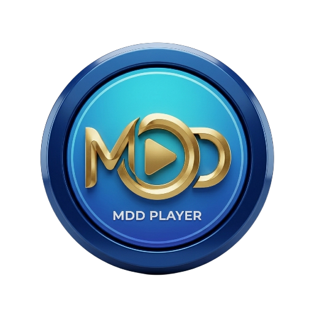

<p align="center">
  
</p>

<h1 align="center">MDD Player</h1>

<p align="center">
  Reproductor de música y video para Android con descargas de alta calidad,<br>
  <b>modo offline</b> y <b>ahorro de datos</b>. Gratis, sin anuncios y de código abierto.
</p>

<p align="center">
  <a href="https://davidmenendez9901.github.io/MDD-Player/"><b>🌐 Página oficial</b></a> ·
  <a href="https://github.com/davidmenendez9901/MDD-Player/releases/latest"><b>⬇️ Descargar APK</b></a> ·
  <a href="https://t.me/mdd_player"><b>Telegram</b></a> ·
  <a href="https://whatsapp.com/channel/0029Vap9Qt24NVios8i5fi2M"><b>WhatsApp</b></a>
</p>

<p align="center">
  <a href="LICENSE"></a>
  
  <a href="https://github.com/davidmenendez9901/MDD-Player/releases"></a>
</p>

---

> [!NOTE]
> **MDD Player es una versión modificada (fork) de [SongTube](https://github.com/SongTube/SongTube-App)**, creada originalmente por [Artx](https://linktr.ee/artxdev) (Airis Team). Esta versión **no es la app oficial de SongTube** ni está afiliada a sus autores originales.
>
> Modificada por **David Menendez**, 2026. Al igual que el original, se distribuye bajo la licencia [GNU GPL v3](LICENSE): todo el código fuente de esta versión está en este repositorio.

## ✨ Novedades de este fork

- **Modo offline** — navega tu biblioteca y reproduce tu contenido sin conexión, sin errores ni pantallas vacías
- **Descargas locales en el reproductor** — lo que descargas queda integrado en el reproductor de música
- **Ahorro de datos** — reproduce solo el audio de los videos para gastar menos datos móviles
- **Insignia de descargado** — identifica de un vistazo qué contenido ya tienes en el dispositivo
- Nuevo nombre, ícono e identidad (`dev.davidmenendez.mddplayer`), instalable junto a la app original

## 📱 Funciones

- Reproductor de música completo (playlists, ecualizador, reproducción en segundo plano)
- Reproductor de video con soporte Picture-in-Picture
- Descarga de video y audio hasta la máxima calidad
- Conversión de audio (AAC, OGG y MP3) con ajustes de volumen, graves y agudos
- Editor de etiquetas y carátulas
- Suscripciones a canales, favoritos e historial
- Abre videos compartidos desde otras apps
- Rutas de descarga personalizadas para audio y video
- Temas claro, oscuro y según el sistema, con personalización de interfaz
- Copia de seguridad y restauración de datos locales

## ⬇️ Descarga

El APK está disponible en la sección de [**Releases**](https://github.com/davidmenendez9901/MDD-Player/releases/latest).

Canales de la comunidad para novedades y soporte:

- Telegram: https://t.me/mdd_player
- WhatsApp: https://whatsapp.com/channel/0029Vap9Qt24NVios8i5fi2M

## 🛠️ Compilar desde el código fuente

Requisitos: [Flutter](https://flutter.dev) (canal estable) y el SDK de Android.

```bash
git clone https://github.com/davidmenendez9901/MDD-Player.git
cd MDD-Player
flutter pub get
flutter build apk --release
```

El APK queda en `build/app/outputs/flutter-apk/`.

## 🌍 Traducciones

La app soporta más de 25 idiomas. Para añadir uno nuevo:

1. Crea un archivo `language<Código>.dart` en [`lib/languages/translations/`](lib/languages/translations/), copiando cualquier idioma existente y traduciendo sus textos (cambia también el nombre de la clase a `Language<Código>`).
2. Registra el idioma en [`lib/languages/languages.dart`](lib/languages/languages.dart): añade un `LanguageData(bandera, nombre, código)` a `_supportedLanguages` y un caso nuevo en `_loadLocale()`.
3. Abre un Pull Request.

## ❤️ Donaciones

MDD Player es gratis y sin anuncios, para siempre. Si quieres apoyar el desarrollo:

- PayPal: https://paypal.me/davidmenendez9901
- Cash App: https://cash.app/$davidmenendez9901

## 🐛 Reportar problemas

Abre un [issue](https://github.com/davidmenendez9901/MDD-Player/issues) describiendo el problema, tu versión de Android y los pasos para reproducirlo.

## 📜 Licencia y créditos

Este proyecto se distribuye bajo la licencia [**GNU GPL v3**](LICENSE).

- Proyecto original: [SongTube](https://github.com/SongTube/SongTube-App), de [Artx](https://linktr.ee/artxdev) (Airis Team)
- Modificaciones de este fork: David Menendez, 2026

Eres libre de usar, estudiar, modificar y redistribuir este software bajo los términos de la misma licencia.
